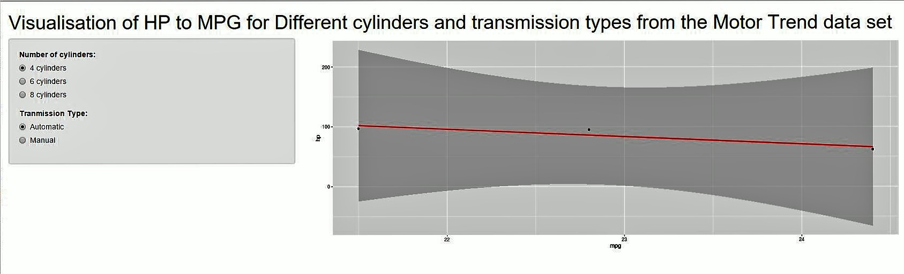

Comparing Fuel Efficiency of cars based upon the number of cylinders and tranmission type
========================================================
author: Geoff Williams  
date: 28/2/2016
autosize: true

Introduction
========================================================
The Application is available from

https://geoffwi40.shinyapps.io/DataProducts/

Using data from the Motor Trend US magazine included with the "R" distribution, the tool shows
the relationship between Horse Power and Miles per Gallon for different cars according to: 

The app visualises the realtionship based upon differnt combinations of :
- Cylinder numbers
- Transmission type

A trend line is then drawn to see if there is some correlection within the results

The Cars
========================================================
The mtcars data comprises the follwing cars that were used in the comparison
<small>

```r
data(mtcars)
rownames(mtcars)
```

```
 [1] "Mazda RX4"           "Mazda RX4 Wag"       "Datsun 710"         
 [4] "Hornet 4 Drive"      "Hornet Sportabout"   "Valiant"            
 [7] "Duster 360"          "Merc 240D"           "Merc 230"           
[10] "Merc 280"            "Merc 280C"           "Merc 450SE"         
[13] "Merc 450SL"          "Merc 450SLC"         "Cadillac Fleetwood" 
[16] "Lincoln Continental" "Chrysler Imperial"   "Fiat 128"           
[19] "Honda Civic"         "Toyota Corolla"      "Toyota Corona"      
[22] "Dodge Challenger"    "AMC Javelin"         "Camaro Z28"         
[25] "Pontiac Firebird"    "Fiat X1-9"           "Porsche 914-2"      
[28] "Lotus Europa"        "Ford Pantera L"      "Ferrari Dino"       
[31] "Maserati Bora"       "Volvo 142E"         
```
</small>


Overall view of HP to MPG
========================================================
If we look at overall whether their seems to be a relationhsip with HP to MPG, there seems to be negative correlation


Using the Tool
========================================================
If we then use the toolk we can then look further into seeing whether this relationship 
still holds for the various cylinder and transmission types

https://geoffwi40.shinyapps.io/DataProducts/


